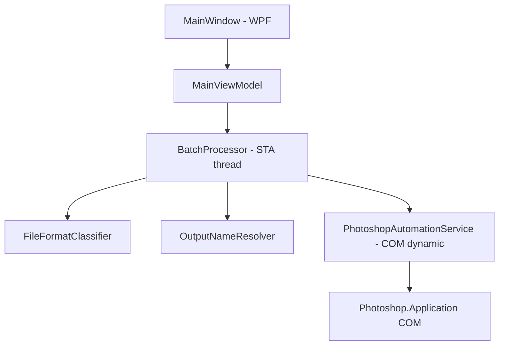
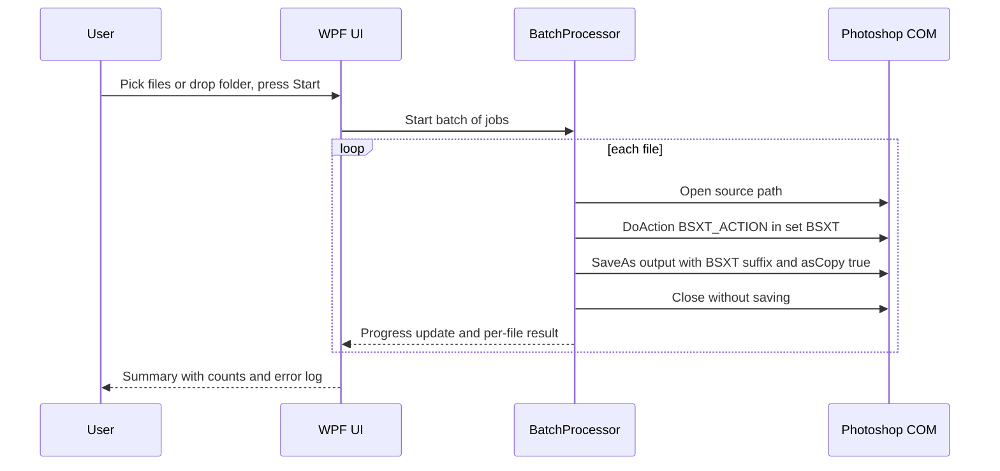

# Development Plan — BSXT Batch Wrapper (.NET)

## 1. Goal

A Windows desktop app (.NET) that:

1. Lets the user select a pile of files (RAW / TIFF / JPG) via a file picker, folder picker, or drag-and-drop.
2. For each file: open it in Photoshop, run the Photoshop action **`BSXT_ACTION (Click Here)`** from the **`BSXT`** action set (the one invoked by the existing [`BSXT.jsx`](BSXT.jsx:22)), then export the result into the **same folder as the source**, with **`BSXT` appended to the filename** (e.g., `photo.jpg` → `photoBSXT.jpg`).
3. Never modifies the original files.
4. Reports progress, per-file results, and errors; supports cancel.

## 2. Key Technical Decisions

### Automation mechanism: Photoshop COM from C# (recommended)

- Drive Photoshop via COM using `Type.GetTypeFromProgID("Photoshop.Application")` + `dynamic` — no interop assemblies or NuGet packages required, works across Photoshop versions.
- `Activator.CreateInstance` attaches to the running Photoshop instance or launches it.
- **Do NOT invoke [`BSXT.jsx`](BSXT.jsx) as-is for the batch.** Two problems:
  - Its `alert()` on failure (line 10) would **block an unattended batch indefinitely**.
  - `#target` / `app.bringToFront()` are unnecessary and interfere with headless-ish operation.
- Instead, call the action directly through COM: `app.DoAction("BSXT_ACTION (Click Here)", "BSXT")`. The JSX is kept in the repo as the documented reference for the exact action/set names.
- Fallback (Plan B, if any action misbehaves under pure COM): generate a per-batch driver `.jsx` (open → doAction → saveAs → close) and run it via `app.DoJavaScriptFile(...)`. Same behavior, script-hosted.

### Per-file processing flow

1. `dynamic doc = app.Open(sourcePath)`
2. `app.DoAction("BSXT_ACTION (Click Here)", "BSXT")`
3. `doc.SaveAs(outputPath, saveOptions, asCopy: true)` — `asCopy` guarantees the original is never touched
4. `doc.Close(saveChanges: false)`

### Save options by format

| Input | Output format | COM options object |
|---|---|---|
| `.jpg` / `.jpeg` | JPEG | `JPEGSaveOptions` (Quality 12, Baseline) |
| `.tif` / `.tiff` | TIFF | `TIFFSaveOptions` (LZW optional) |
| RAW (`.cr2 .cr3 .nef .arw .raf .orf .rw2 .dng` …) | **TIFF** (default proposal — RAW cannot be saved back as RAW) | `TIFFSaveOptions` |
| `.psd` (optional) | PSD | `PSDSaveOptions` |

### Naming & collision policy

- Output name: `{originalName}BSXT.{ext}` inserted before the extension (alternative `..._BSXT` — open question).
- Collision (output already exists): default = overwrite, with a user option to *Skip* or *Number suffix* (`photoBSXT (2).jpg`).
- Files whose name already ends in `BSXT` are skipped by default (prevents re-processing outputs).

### Threading

- The Photoshop COM object must be used from a **single STA thread**.
- Run the batch loop on a dedicated STA worker thread; marshal progress/log messages to the UI with `IProgress<T>`.
- Cancellation is honored **between files** (not mid-action).

## 3. Prerequisites & Known Risks

| Item | Detail | Mitigation |
|---|---|---|
| Action set loaded | `BSXT` set must be loaded in Photoshop at runtime | Preflight check: enumerate loaded action sets; show a clear actionable error if missing |
| Camera Raw modal dialog | Opening RAW files may pop the ACR "Save Image" dialog and hang the batch | Document requirement to disable ACR open dialog; detect hang & surface instructions |
| Action bit-depth assumptions | Action may expect 8-bit vs 16-bit docs | Test matrix includes RAW/TIFF/JPG; document any mode-conversion step needed in the action |
| Write permissions | Output goes next to source | Preflight writable check per folder; per-file error isolation |
| Photoshop not installed | COM ProgID missing | Startup check with friendly message |

## 4. Project Structure

```
BackscatterRemovalWrapper/
├── BSXT.jsx                      # existing — reference for action/set names
├── plans/
│   └── bsxt-batch-wrapper.md     # this plan
└── src/
    └── BsxtBatch/                # .NET 8 solution
        ├── BsxtBatch.App/        # WPF app (MVVM)
        │   ├── Views/MainWindow.xaml
        │   ├── ViewModels/MainViewModel.cs
        │   └── App.xaml
        ├── BsxtBatch.Core/       # class library (testable, no UI deps)
        │   ├── Photoshop/PhotoshopAutomationService.cs   # COM interop via dynamic
        │   ├── Batch/BatchProcessor.cs                   # queue, STA loop, cancel
        │   ├── Naming/OutputNameResolver.cs
        │   ├── Formats/FileFormatClassifier.cs           # ext → save options
        │   └── Models/ (ImageJob, JobResult, BatchOptions)
        └── BsxtBatch.Core.Tests/
```

### Architecture



### Sequence



## 5. UI (default: WPF, MVVM)

- **Toolbar**: *Add Files…*, *Add Folder…*, drag-and-drop zone, *Remove*, *Clear*.
- **Options row**: RAW output format (TIFF/JPEG), overwrite policy (Overwrite/Skip/Number), quality for JPEG output.
- **Job list**: filename, detected format, status (`Queued / Processing / Done / Skipped / Error: msg`).
- **Progress bar** + overall elapsed; **Start** / **Cancel** buttons.
- **Log pane** (scrollable, copyable) for diagnostics.

## 6. Phases

- **Phase 0 — COM spike**: console app proves: attach to Photoshop, open a JPG, `DoAction`, `SaveAs` with `asCopy`, close. Validates action/set names against the live install.
- **Phase 1 — Core library**: `PhotoshopAutomationService`, `FileFormatClassifier`, `OutputNameResolver`, `BatchProcessor` (STA + `IProgress` + cancel).
- **Phase 2 — WPF UI**: file/folder selection, drag-and-drop, options, job list, progress, log.
- **Phase 3 — Robustness**: missing-action-set preflight, ACR-dialog guidance, permission checks, error isolation, cancellation, re-run of failed files.
- **Phase 4 — Verification & packaging**: manual test matrix (JPG, TIFF, CR3/NEF/ARW, mixed batch, spaces/unicode in names, collision cases); `dotnet publish` self-contained single-file exe; README with prerequisites and troubleshooting.

## 7. Manual Test Matrix (Phase 4)

| Case | Expectation |
|---|---|
| Single JPG | `x.jpg` + `xBSXT.jpg`, original byte-identical |
| Single TIFF | `x.tif` + `xBSXT.tif` |
| RAW file | `x.CR3` + `xBSXT.tif` (or chosen format), no ACR hang |
| Mixed batch of 10 | all processed, per-file statuses correct |
| Output exists + Overwrite | replaced |
| Output exists + Skip | status *Skipped* |
| Action set not loaded | batch refuses to start with instructions |
| Photoshop closed at Start | Photoshop launches and batch proceeds |
| Cancel mid-batch | stops after current file, no partial saves |

## 8. Open Decisions (need confirmation)

1. **UI framework** — WPF (default) vs WinForms (simpler) vs console-only.
2. **RAW output format** — TIFF (default) vs JPEG vs per-file user choice.
3. **Naming** — `photoBSXT.tif` (default) vs `photo_BSXT.tif`.
4. **Collision default** — Overwrite vs Skip vs Number.
